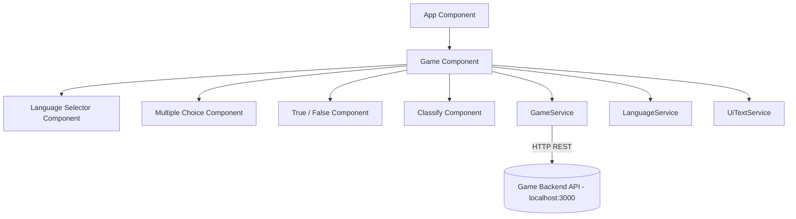
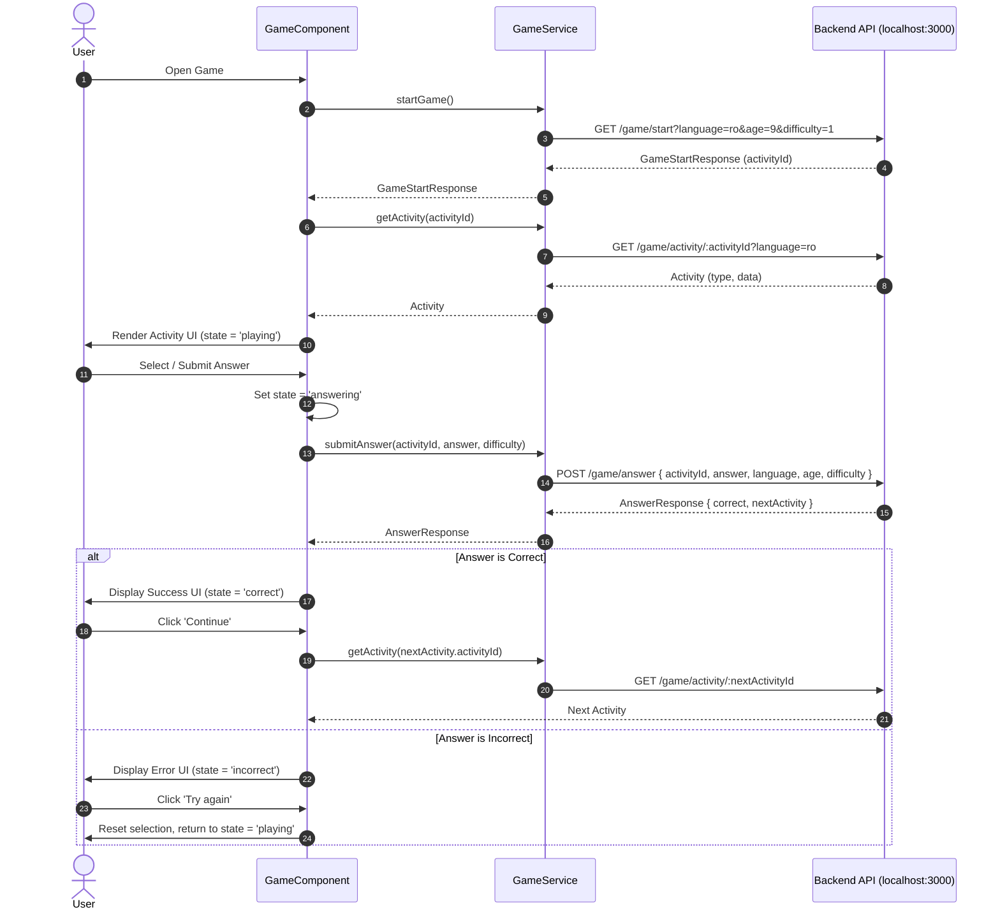
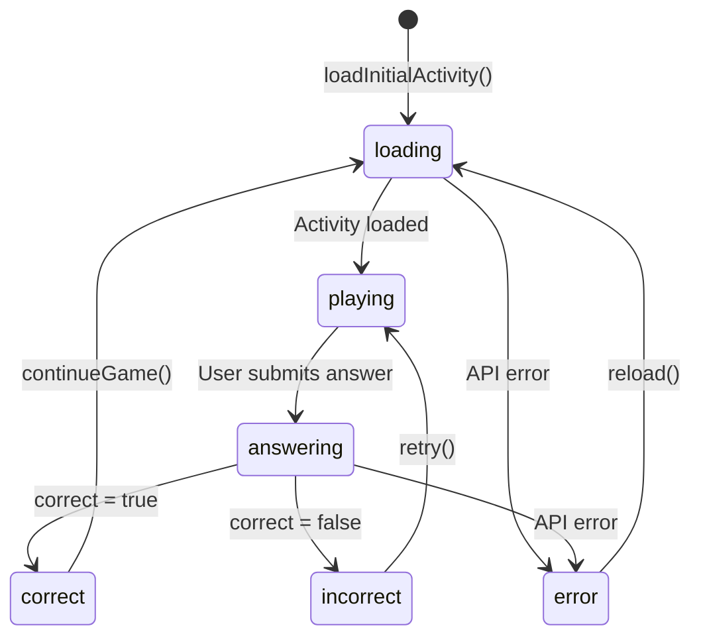

# Knowle (Knowledge Adventure)

**Knowle** is an interactive educational web game built with Angular 20 and Angular Material. It delivers dynamic learning challenges across multiple game modes—including multiple-choice questions, true/false questions, and item classification—with real-time feedback, difficulty tracking, and bilingual support (Romanian and English).

---

## Table of Contents

- [Architectural Overview](#architectural-overview)
- [Component Structure](#component-structure)
- [Data Model](#data-model)
  - [Core Types](#core-types)
  - [Activity Data Models](#activity-data-models)
  - [Discriminated Union (`Activity`)](#discriminated-union-activity)
  - [Response Contracts](#response-contracts)
- [Backend-Frontend Communication Logic](#backend-frontend-communication-logic)
  - [API Endpoints](#api-endpoints)
  - [Game Lifecycle & Interaction Flow](#game-lifecycle--interaction-flow)
  - [Difficulty Mapping](#difficulty-mapping)
- [State Management & Lifecycle](#state-management--lifecycle)
- [Internationalization (i18n)](#internationalization-i18n)
- [Project Directory Structure](#project-directory-structure)
- [Getting Started](#getting-started)
  - [Prerequisites](#prerequisites)
  - [Installation & Running](#installation--running)
  - [Available Scripts](#available-scripts)

---

## Architectural Overview

The application is architected around modern Angular standalone components and reactive RxJS patterns:

- **Presentation Layer**: Standalone Angular components for the game container, specific activity renderers, and internationalization controls.
- **Service Layer**:
  - `GameService`: Manages REST communication with the game backend server.
  - `LanguageService`: Manages language state with a reactive `BehaviorSubject` and `localStorage` persistence.
  - `UiTextService`: Supplies localized UI dictionary strings.
- **Data & Model Layer**: Strongly-typed TypeScript interfaces defined as discriminated unions for safe activity rendering and answer submission.



---

## Component Structure

- **Game Container**: [src/app/components/game/game.component.ts](src/app/components/game/game.component.ts) orchestrates the state machine (`loading`, `playing`, `answering`, `correct`, `incorrect`, `error`), initiates new game sessions, submits answers, and renders child components dynamically.
- **Activity Renderers**:
  - **Multiple Choice**: [src/app/components/multiple-choice/multiple-choice.component.ts](src/app/components/multiple-choice/multiple-choice.component.ts) renders single-selection questions with multiple options.
  - **True / False**: [src/app/components/true-false/true-false.component.ts](src/app/components/true-false/true-false.component.ts) renders binary true/false questions.
  - **Classify**: [src/app/components/classify/classify.component.ts](src/app/components/classify/classify.component.ts) renders categorization boards where users classify individual items into target categories before submitting.
- **Language Selector**: [src/app/components/language-selector/language-selector.component.ts](src/app/components/language-selector/language-selector.component.ts) provides a language dropdown that updates the application language in real-time.

---

## Data Model

All game contracts and data types are defined in [src/app/shared/models/game.types.ts](src/app/shared/models/game.types.ts).

### Core Types

```typescript
export type ActivityType =
  | 'MULTIPLE_CHOICE'
  | 'TRUE_FALSE'
  | 'MATCHING'
  | 'ORDERING'
  | 'CLASSIFY'
  | 'DRAG_DROP'
  | 'FILL_BLANK'
  | 'MAP';

export type Difficulty = 'EASY' | 'MEDIUM' | 'HARD';
```

### Activity Data Models

Each activity type has a tailored data payload:

```typescript
// Multiple Choice
export interface MultipleChoiceActivityData {
  question: string;
  options: string[];
}

// True / False
export interface TrueFalseActivityData {
  question: string;
  options: [boolean, boolean];
}

// Classify (Categorization)
export interface ClassifyItem {
  id: string;
  label: string;
}

export interface ClassifyCategory {
  id: string;
  label: string;
}

export interface ClassifyActivityData {
  question: string;
  items: ClassifyItem[];
  categories: ClassifyCategory[];
}

export type ActivityData =
  | MultipleChoiceActivityData
  | TrueFalseActivityData
  | ClassifyActivityData;
```

### Discriminated Union (`Activity`)

Activities received from the backend use the `type` discriminant to ensure type safety:

```typescript
export interface MultipleChoiceActivity {
  activityId: string;
  title: string;
  type: 'MULTIPLE_CHOICE';
  difficulty: Difficulty;
  data: MultipleChoiceActivityData;
}

export interface TrueFalseActivity {
  activityId: string;
  title: string;
  type: 'TRUE_FALSE';
  difficulty: Difficulty;
  data: TrueFalseActivityData;
}

export interface ClassifyActivity {
  activityId: string;
  title: string;
  type: 'CLASSIFY';
  difficulty: Difficulty;
  data: ClassifyActivityData;
}

export type Activity = MultipleChoiceActivity | TrueFalseActivity | ClassifyActivity;
```

### Response Contracts

```typescript
// Response when initiating a game
export interface GameStartResponse {
  activityId: string;
  title: string;
  type: ActivityType;
  difficulty: Difficulty;
}

// Next activity metadata provided after answering
export interface NextActivity {
  activityId: string;
  title: string;
  type: ActivityType;
  difficulty: Difficulty;
}

// Response when validating an answer
export interface AnswerResponse {
  correct: boolean;
  nextActivity: NextActivity | null;
  retry?: boolean;
  message?: string;
}
```

---

## Backend-Frontend Communication Logic

Backend communication is handled by `GameService` ([src/app/shared/services/game.service.ts](src/app/shared/services/game.service.ts)), interacting with the REST API at `http://localhost:3000`.

### API Endpoints

#### 1. Start Game (`GET /game/start`)

Initiates a new game session and returns metadata for the initial challenge.

- **Query Parameters**:
  - `language` (`string`): Current active language (`'ro'` | `'en'`).
  - `age` (`string`): Target player age (default: `'9'`).
  - `difficulty` (`string`): Initial difficulty level (`'1'`).
- **Response (`GameStartResponse`)**:
  ```json
  {
    "activityId": "act_101",
    "title": "Solar System",
    "type": "MULTIPLE_CHOICE",
    "difficulty": "EASY"
  }
  ```

#### 2. Get Activity Details (`GET /game/activity/:activityId`)

Fetches full details and question content for a specific activity.

- **URL Parameters**: `:activityId` (ID of the target activity).
- **Query Parameters**:
  - `language` (`string`): Language code (`'ro'` | `'en'`).
- **Response (`Activity`)**:
  ```json
  {
    "activityId": "act_101",
    "title": "Solar System",
    "type": "MULTIPLE_CHOICE",
    "difficulty": "EASY",
    "data": {
      "question": "Which planet is known as the Red Planet?",
      "options": ["Mars", "Venus", "Jupiter", "Saturn"]
    }
  }
  ```

#### 3. Submit Answer (`POST /game/answer`)

Submits the user's answer for evaluation.

- **Request Body**:
  ```json
  {
    "activityId": "act_101",
    "answer": "Mars",
    "language": "en",
    "age": 9,
    "difficulty": 1
  }
  ```
  _(Note: For `CLASSIFY` activities, `answer` is an object mapping item IDs to category IDs: `Record<string, string>`)_.
- **Response (`AnswerResponse`)**:
  ```json
  {
    "correct": true,
    "nextActivity": {
      "activityId": "act_102",
      "title": "Continents",
      "type": "CLASSIFY",
      "difficulty": "MEDIUM"
    },
    "message": "Well done!"
  }
  ```

### Game Lifecycle & Interaction Flow



### Difficulty Mapping

Difficulty ratings are converted to numeric levels when sending answers to the backend:

| Difficulty Name | Numeric Value |
| :-------------- | :------------ |
| `EASY`          | `1`           |
| `MEDIUM`        | `2`           |
| `HARD`          | `3`           |

---

## State Management & Lifecycle

The game UI transitions between the following states:

- `loading`: Initial load or fetching activity data.
- `playing`: Interactive question presented to the user.
- `answering`: Waiting for backend validation.
- `correct`: Displays success feedback and unlocks the "Continue" action.
- `incorrect`: Displays feedback and unlocks the "Try again" action.
- `error`: Backend communication failures, offering a retry action.



---

## Internationalization (i18n)

The application includes real-time bilingual support without requiring a full page refresh:

- **Supported Locales**: Romanian (`'ro'`, default) and English (`'en'`).
- **Language Service** ([src/app/shared/services/language.service.ts](src/app/shared/services/language.service.ts)):
  - Persists preference in browser `localStorage` under `knowle-language`.
  - Exposes `languageChanged$` observable.
- **Dynamic Content Updates**:
  - UI labels are translated dynamically via `UiTextService` ([src/app/shared/services/ui-text.service.ts](src/app/shared/services/ui-text.service.ts)) and [src/app/shared/i18n/ui-translations.ts](src/app/shared/i18n/ui-translations.ts).
  - When the user changes the language, `GameComponent` listens to `languageChanged$` and immediately re-fetches the current activity from the backend in the newly selected language while preserving the active user flow.

---

## Project Directory Structure

```
src/
├── app/
│   ├── app.config.ts                           # Global application providers (HttpClient, animations)
│   ├── app.ts                                  # Root shell component
│   ├── components/
│   │   ├── classify/                           # Categorization activity component
│   │   │   ├── classify.component.css
│   │   │   ├── classify.component.html
│   │   │   └── classify.component.ts
│   │   ├── game/                               # Core game container and state controller
│   │   │   ├── game.component.css
│   │   │   ├── game.component.html
│   │   │   └── game.component.ts
│   │   ├── language-selector/                  # Language picker component
│   │   │   ├── language-selector.component.css
│   │   │   ├── language-selector.component.html
│   │   │   └── language-selector.component.ts
│   │   ├── multiple-choice/                    # Multiple choice activity component
│   │   │   ├── multiple-choice.component.css
│   │   │   ├── multiple-choice.component.html
│   │   │   └── multiple-choice.component.ts
│   │   └── true-false/                         # True / False activity component
│   │       ├── true-false.component.css
│   │       ├── true-false.component.html
│   │       └── true-false.component.ts
│   └── shared/
│       ├── i18n/
│       │   └── ui-translations.ts              # Dictionary for UI text strings (RO / EN)
│       ├── models/
│       │   └── game.types.ts                   # Data models and API contract interfaces
│       └── services/
│           ├── game.service.ts                 # Backend communication service
│           ├── language.service.ts             # Language state & storage management
│           └── ui-text.service.ts              # UI translation lookup service
├── main.ts                                     # Angular application entry point
├── styles.css                                  # Global styles and layout defaults
└── styles.scss                                 # Material theme and SCSS definitions
```

---

## Getting Started

### Prerequisites

- [Node.js](https://nodejs.org/) (version 18+ or compatible with Angular 20)
- npm or yarn package manager
- Game backend service running on `http://localhost:3000`

### Installation & Running

1. **Install dependencies**:

   ```bash
   npm install
   ```

2. **Start the development server**:

   ```bash
   npm start
   # or: ng serve
   ```

3. Open your browser and navigate to `http://localhost:4200/`.

### Available Scripts

- `npm start`: Starts the local development server at `http://localhost:4200/`.
- `npm run build`: Compiles production build artifacts into the `dist/` directory.
- `npm run watch`: Builds in development mode and watches for file changes.
- `npm test`: Runs unit tests via Karma.

alegere multiplă, drag-and-drop, potrivire, ordonare, calcul, identificare pe hartă și mici puzzle-uri.
